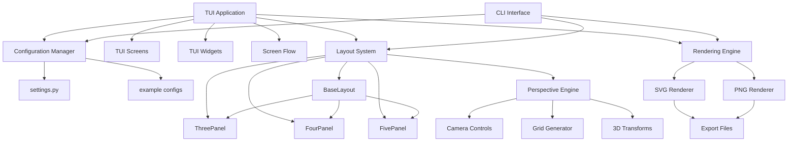
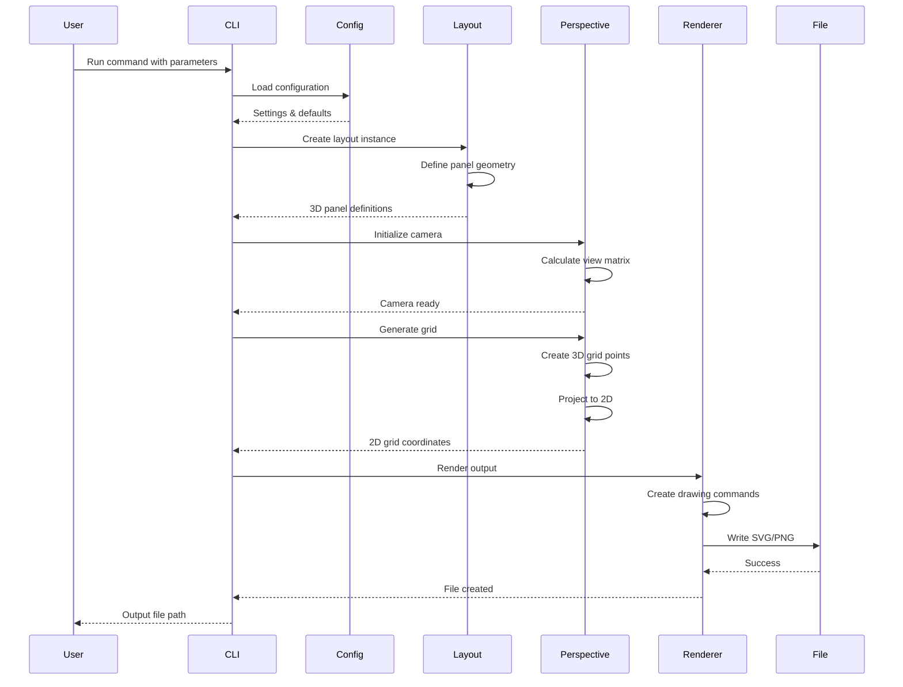
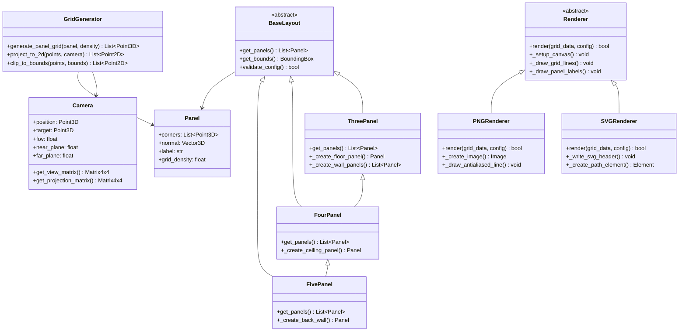
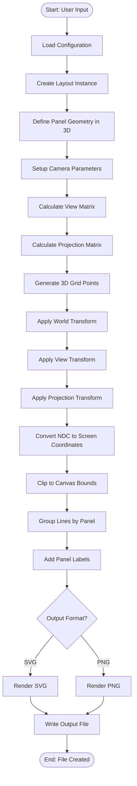
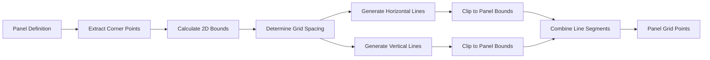

# Forced Aspect Perspective Grid Tool - Technical Design

## System Architecture Diagrams

### High-Level Component Architecture



### Data Flow Sequence



### Class Relationship Diagram



## Core Algorithm Flow

### Perspective Projection Pipeline



### Grid Generation Detail



## Key Technical Specifications

### Coordinate Systems

**3D World Space:**
- Origin at room corner (floor level)
- X-axis: Left wall to right wall
- Y-axis: Floor to ceiling  
- Z-axis: Front to back
- Units: Abstract (scaled during rendering)

**2D Screen Space:**
- Origin at top-left of canvas
- X-axis: Left to right
- Y-axis: Top to bottom
- Units: Pixels or SVG units

### Camera Model

**Perspective Projection:**
```
x_screen = (x_3d * focal_length) / z_3d
y_screen = (y_3d * focal_length) / z_3d
```

**Field of View Calculation:**
```
focal_length = canvas_width / (2 * tan(fov / 2))
```

### Grid Density Algorithm

**Adaptive Spacing:**
- Base grid spacing in 3D world units
- Perspective scaling factor based on distance from camera
- Minimum screen-space line separation to avoid overcrowding
- Maximum subdivision depth for performance

### Performance Considerations

**Optimization Strategies:**
- Frustum culling for off-screen grid lines
- Level-of-detail grid generation
- Spatial partitioning for large grids
- Efficient 2D clipping algorithms
- Memory-conscious point generation

**Target Performance:**
- Grid generation: < 100ms for typical configurations
- SVG rendering: < 500ms for high-density grids
- PNG rendering: < 2s for 300 DPI output
- Memory usage: < 100MB for largest configurations
