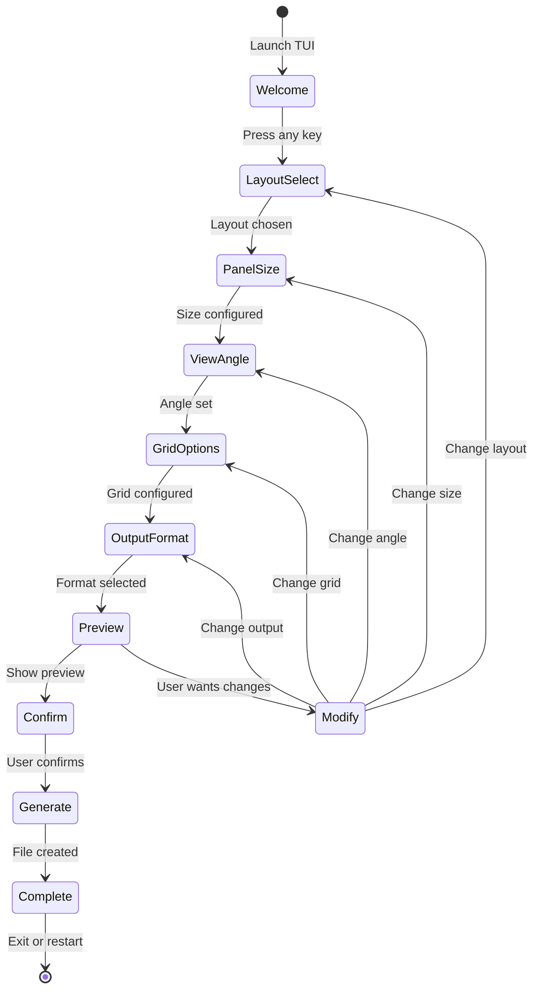
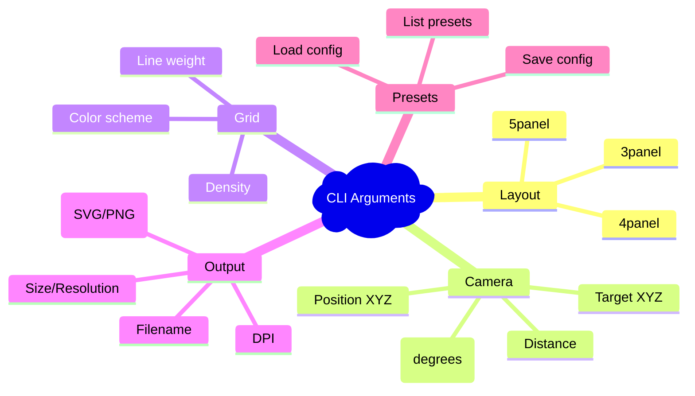
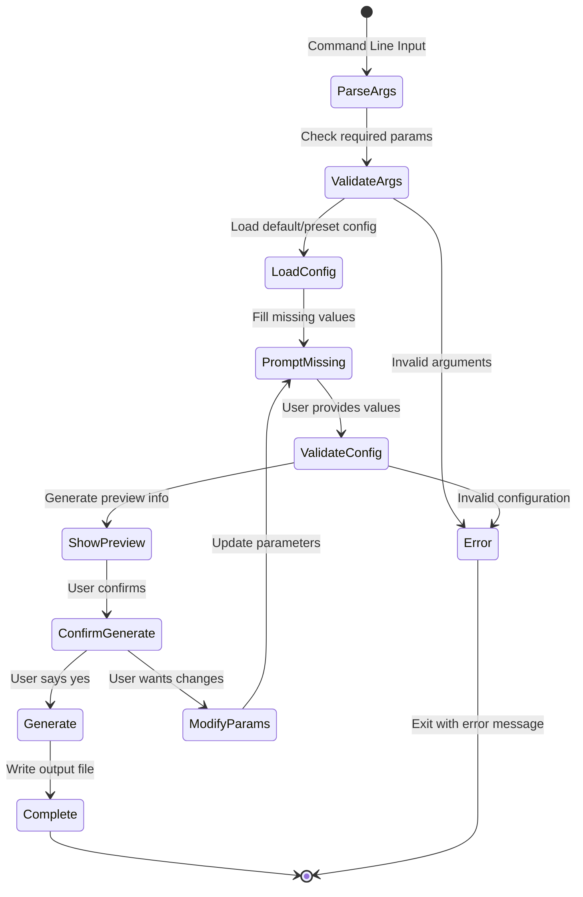
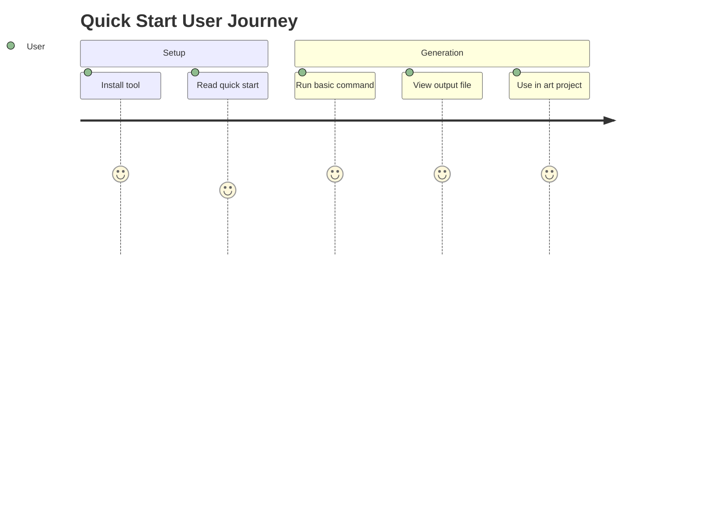
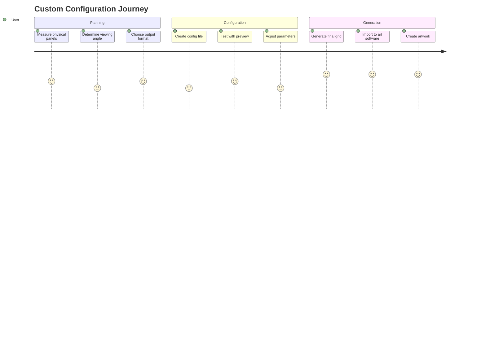
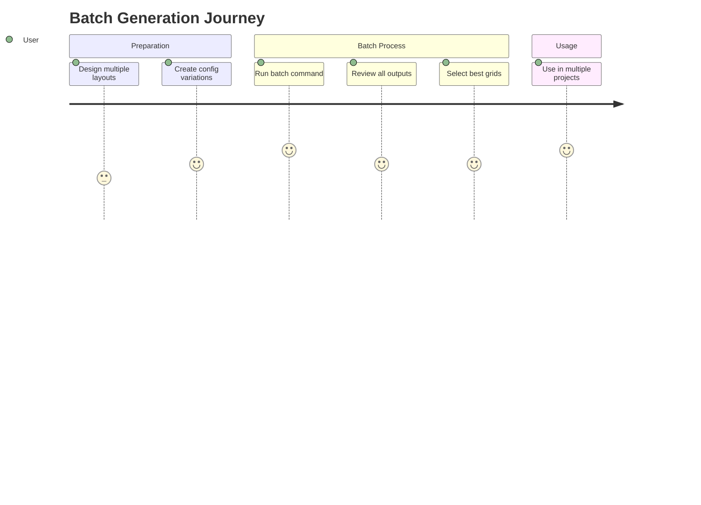
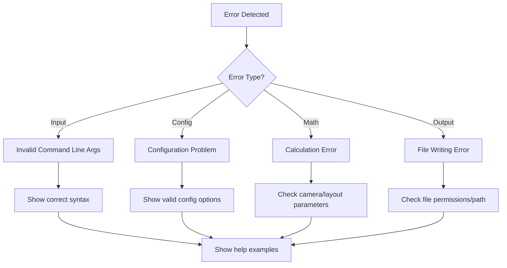
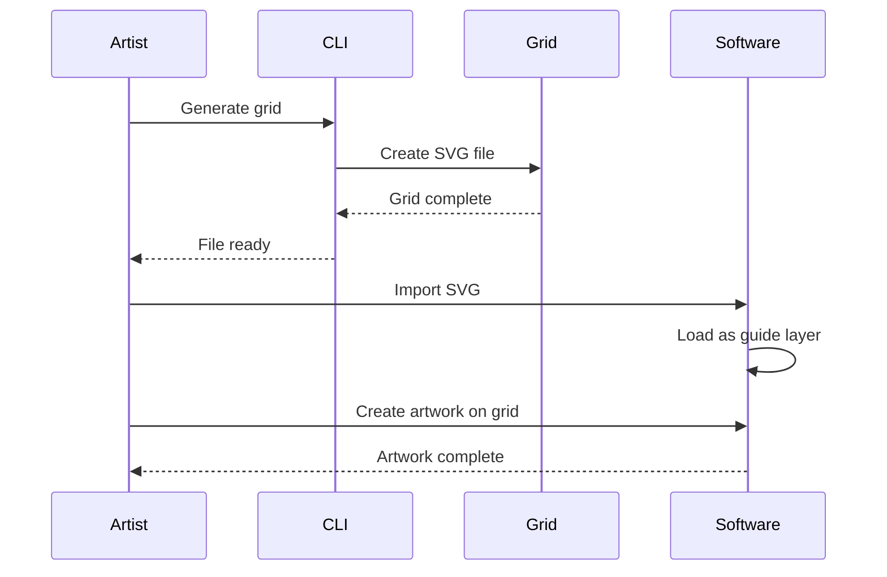
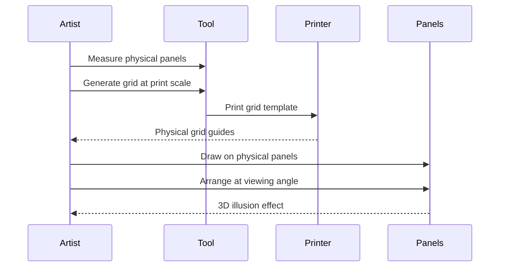

# User Interface & Interaction Design

## Terminal User Interface (TUI) - Primary Interface

### TUI Application Overview

A guided, step-by-step terminal interface that makes the tool accessible to non-developers. Users navigate through configuration options using arrow keys and selections, with real-time preview information.

### TUI Flow Design



### Screen-by-Screen Walkthrough

#### Screen 1: Welcome & Layout Selection
```
╔══════════════════════════════════════════════════════════════╗
║                 Forced Aspect Grid Generator                 ║
║               Perfect perspective grids for                  ║
║                   3D panel compositions                      ║
╠══════════════════════════════════════════════════════════════╣
║                                                              ║
║  Select your panel layout:                                   ║
║                                                              ║
║  ► 3-Panel Corner Room    [Floor + 2 walls]                 ║
║    4-Panel + Ceiling      [Floor + 2 walls + ceiling]       ║
║    5-Panel Full Room      [Floor + ceiling + 3 walls]       ║
║                                                              ║
║  Use ↑↓ to navigate, ENTER to select, ESC to exit          ║
╚══════════════════════════════════════════════════════════════╝
```

#### Screen 2: Panel Size Configuration
```
╔══════════════════════════════════════════════════════════════╗
║  3-Panel Corner Room Selected                                ║
╠══════════════════════════════════════════════════════════════╣
║                                                              ║
║  Configure your physical panel dimensions:                   ║
║                                                              ║
║  Panel Size Presets:                                         ║
║    ► Standard (6" × 6")                                      ║
║      Small (4" × 4")                                         ║
║      Large (8" × 8")                                         ║
║      Custom dimensions                                       ║
║                                                              ║
║  Room Scale (optional):                                      ║
║    Width:  [12 feet    ]  Height: [8 feet     ]            ║
║    Depth:  [12 feet    ]                                     ║
║                                                              ║
║  ← BACK     ENTER to continue                               ║
╚══════════════════════════════════════════════════════════════╝
```

#### Screen 3: Viewing Angle & Camera
```
╔══════════════════════════════════════════════════════════════╗
║  Panel Size: 6" × 6" Standard                                ║
╠══════════════════════════════════════════════════════════════╣
║                                                              ║
║  Choose viewing angle and camera settings:                   ║
║                                                              ║
║  Viewing Distance Presets:                                   ║
║    ► Normal View (8 feet)     [Balanced perspective]        ║
║      Close View (5 feet)      [Dramatic perspective]        ║
║      Distant View (12 feet)   [Mild perspective]            ║
║      Orthographic            [No perspective/technical]      ║
║                                                              ║
║  Field of View: [50°] ←→ (20° - 120°)                      ║
║                                                              ║
║  Advanced: Custom camera position                            ║
║    X: [0.0]  Y: [4.0]  Z: [8.0]                            ║
║                                                              ║
║  ← BACK     ENTER to continue                               ║
╚══════════════════════════════════════════════════════════════╝
```

#### Screen 4: Grid & Visual Options
```
╔══════════════════════════════════════════════════════════════╗
║  Camera: Normal View, 50° FOV                                ║
╠══════════════════════════════════════════════════════════════╣
║                                                              ║
║  Grid and visual options:                                    ║
║                                                              ║
║  Grid Density: [●●●○○] Fine ←→ Coarse                       ║
║                                                              ║
║  Visual Options:                                             ║
║    [✓] Show panel boundaries                                 ║
║    [✓] Label panels (Floor, Wall L, Wall R)                 ║
║    [ ] Show vanishing point guides                          ║
║                                                              ║
║  Line Style:                                                 ║
║    Weight: [●●○○○] Thin ←→ Thick                             ║
║    Color:  [#333333] ⬛ Dark Gray                            ║
║                                                              ║
║  ← BACK     ENTER to continue                               ║
╚══════════════════════════════════════════════════════════════╝
```

#### Screen 5: Output Format & File
```
╔══════════════════════════════════════════════════════════════╗
║  Grid: Medium density, labeled panels                        ║
╠══════════════════════════════════════════════════════════════╣
║                                                              ║
║  Choose output format and size:                              ║
║                                                              ║
║  Format:                                                     ║
║    ► SVG (Vector - scalable, editable)                      ║
║      PNG (Raster - print ready)                             ║
║                                                              ║
║  Canvas Size:                                                ║
║    ► Web/Screen (1920 × 1080)                               ║
║      Print Letter (8.5" × 11" @ 300 DPI)                   ║
║      Print Tabloid (11" × 17" @ 300 DPI)                   ║
║      Custom                                                  ║
║                                                              ║
║  Filename: [my_grid_3panel_6x6] .svg                        ║
║  Location: [./exports/]                                      ║
║                                                              ║
║  ← BACK     ENTER to preview                                ║
╚══════════════════════════════════════════════════════════════╝
```

#### Screen 6: Preview & Confirmation
```
╔══════════════════════════════════════════════════════════════╗
║  Configuration Preview                                        ║
╠══════════════════════════════════════════════════════════════╣
║                                                              ║
║  Layout:      3-Panel Corner Room                           ║
║  Panels:      6" × 6" (3 panels total)                      ║
║  Camera:      Normal view, 8ft distance, 50° FOV            ║
║  Grid:        Medium density, labeled                        ║
║  Output:      SVG, 1920×1080 pixels                         ║
║  File:        ./exports/my_grid_3panel_6x6.svg              ║
║                                                              ║
║  Estimated:   847 grid lines, ~15KB file size               ║
║  Generate:    <1 second                                      ║
║                                                              ║
║  ┌─────────────────────────────────────────────────────────┐ ║
║  │  [M] Modify Settings    [G] Generate Grid    [Q] Quit   │ ║
║  └─────────────────────────────────────────────────────────┘ ║
║                                                              ║
║  Quick regenerate: [S] Save as preset for future use        ║
╚══════════════════════════════════════════════════════════════╝
```

### TUI Implementation Plan

#### Technology Stack
- **Python Rich** - Beautiful terminal interfaces with colors and layouts
- **Python Textual** - Full TUI framework with widgets and layouts
- **Click** - Enhanced command-line argument parsing
- **Keyboard navigation** - Arrow keys, Enter, Escape, Tab

#### Key TUI Features
1. **Progressive Disclosure** - Only show relevant options at each step
2. **Visual Feedback** - Real-time preview info and validation
3. **Easy Navigation** - Consistent keyboard controls throughout
4. **Smart Defaults** - Sensible defaults for quick workflows
5. **Help Integration** - Context-sensitive help at each step
6. **Error Prevention** - Validation before moving to next step

## Command Line Interface (CLI) Specification

### Basic Usage Pattern

```bash
# Quick generation with defaults
python main.py --layout 3panel --output my_grid.svg

# Full configuration
python main.py \
  --layout 5panel \
  --fov 60 \
  --distance 10 \
  --grid-density 0.5 \
  --size 1920x1080 \
  --format png \
  --dpi 300 \
  --output exports/room_grid.png
```

### Command Line Arguments



### Interactive Configuration Flow



## Configuration File System

### JSON Configuration Schema

```json
{
  "preset_name": "corner_room_standard",
  "description": "Standard 3-panel corner room for 6x6 inch panels",
  "layout": {
    "type": "3panel",
    "panel_size": {
      "width": 6.0,
      "height": 6.0,
      "units": "inches"
    },
    "room_dimensions": {
      "width": 12.0,
      "depth": 12.0,
      "height": 8.0,
      "units": "feet"
    }
  },
  "camera": {
    "position": [0, 4, 8],
    "target": [0, 0, 0],
    "fov": 50,
    "units": "feet"
  },
  "grid": {
    "density": 0.5,
    "style": {
      "line_weight": 1,
      "color": "#333333",
      "opacity": 0.8
    }
  },
  "output": {
    "format": "svg",
    "size": {
      "width": 1920,
      "height": 1080,
      "units": "pixels"
    },
    "show_labels": true,
    "show_panels": true
  }
}
```

### Preset Categories

```mermaid
graph TD
    Presets[Configuration Presets] --> PanelSize[Panel Size Presets]
    Presets --> ViewAngle[Viewing Angle Presets]
    Presets --> OutputFormat[Output Format Presets]
    
    PanelSize --> Small[Small Panels 4x4"]
    PanelSize --> Standard[Standard Panels 6x6"]
    PanelSize --> Large[Large Panels 8x8"]
    
    ViewAngle --> Close[Close View - Wide FOV]
    ViewAngle --> Normal[Normal View - 50° FOV]
    ViewAngle --> Distant[Distant View - Narrow FOV]
    ViewAngle --> Ortho[Orthographic View]
    
    OutputFormat --> WebSVG[Web SVG - 1920x1080]
    OutputFormat --> PrintPNG[Print PNG - 300 DPI]
    OutputFormat --> LargePrint[Large Print - 600 DPI]
```

## User Workflow Examples

### Workflow 1: Quick Start with Defaults



**Commands:**
```bash
# User just wants a basic 3-panel grid
python main.py --layout 3panel --output my_grid.svg
# Tool uses all defaults, generates SVG in seconds
```

### Workflow 2: Custom Configuration



**Commands:**
```bash
# User creates custom configuration
python main.py --save-config my_setup.json
# Edit my_setup.json with specific requirements
python main.py --config my_setup.json --output final_grid.png
```

### Workflow 3: Batch Generation



**Commands:**
```bash
# Generate multiple variations
python main.py --config-dir presets/ --output-dir exports/
# Generates one file per config in presets/
```

## Error Handling & User Feedback

### Progressive Error Messages



### Success Feedback

**Console Output:**
```
✓ Configuration loaded: corner_room_standard
✓ Camera setup: FOV 50°, distance 8.0 feet
✓ Layout generated: 3-panel corner room
✓ Grid computed: 1,247 lines across 3 panels
✓ SVG rendered: 1920x1080 pixels
✓ File saved: exports/my_grid.svg (23.4 KB)

Preview: Open file in browser or vector graphics software
```

### Help System

```bash
# Context-sensitive help
python main.py --help                    # General help
python main.py --layout --help           # Layout-specific help
python main.py --config --help           # Configuration help
python main.py --examples                # Show example commands
python main.py --presets                 # List available presets
```

## Integration Points

### Art Software Workflow



### Physical Panel Workflow


